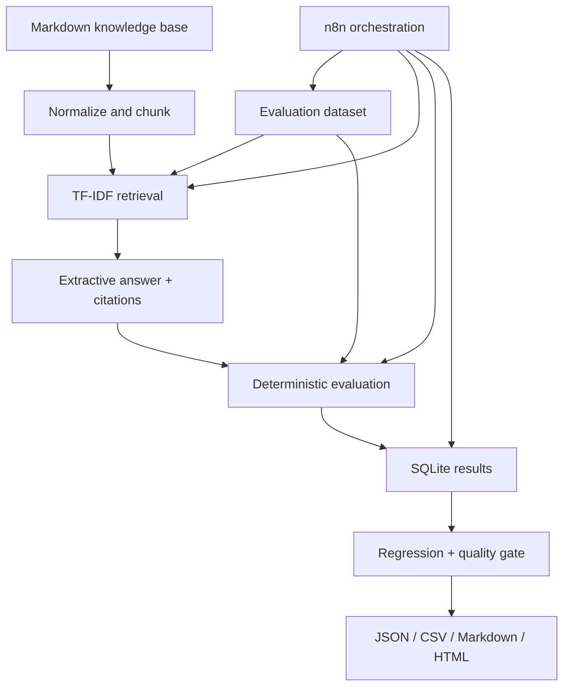

# RAG Quality Evaluation & Regression Pipeline

A locally runnable quality-engineering system that measures whether a retrieval-augmented generation pipeline finds the expected source, includes required facts, cites retrieved evidence, handles unanswerable questions, stays grounded in context, and passes version-controlled quality thresholds.

The default mode is deterministic. It requires no API key, paid LLM, vector database, cloud deployment, or external website.

## What this demonstrates

- Python and FastAPI API engineering
- Deterministic TF-IDF retrieval without a machine-learning dependency
- Extractive generation with traceable citations
- Twelve version-controlled RAG evaluation cases
- Per-question and aggregate quality metrics
- SQLite audit history
- Baseline-versus-candidate regression analysis
- Machine-readable PASS/FAIL quality gates
- HTML, Markdown, CSV, and JSON evidence
- Docker Compose and self-hosted n8n orchestration

## Architecture



## Fastest Windows path

Prerequisites:

- Windows 10/11 and PowerShell
- Docker Desktop with the engine running
- Ports `5681` and `8003` available

From the extracted project folder:

```powershell
powershell.exe -ExecutionPolicy Bypass -File .\scripts\start-demo.ps1
```

Then run the complete verification:

```powershell
powershell.exe -ExecutionPolicy Bypass -File .\scripts\verify-first-run.ps1
```

Expected result:

- 5 documents ingested
- 12 evaluation cases executed
- unit tests pass
- baseline gate is `PASS`
- weak candidate gate is `FAIL`
- per-question regression classifications are produced
- reports appear under `reports/`
- results persist in SQLite

Open:

- FastAPI/OpenAPI: <http://localhost:8003/docs>
- n8n: <http://localhost:5681>

For detailed zero-to-result instructions, use [START-HERE-WINDOWS.md](START-HERE-WINDOWS.md).

## Repository tree

```text
rag-quality-evaluation-pipeline/
├── .github/workflows/rag-evaluation.yml
├── config/quality-gates.yaml
├── docs/
├── evaluation-data/eval_dataset.json
├── evidence/
├── knowledge-base/
├── n8n/
│   ├── import-instructions.md
│   └── rag-evaluation-workflow.json
├── reports/
├── scripts/
├── service/
│   ├── app/
│   ├── tests/
│   ├── Dockerfile
│   └── requirements.txt
├── docker-compose.yml
├── README.md
├── START-HERE-WINDOWS.md
└── PORTFOLIO.md
```

## Individual demonstrations

Passing baseline:

```powershell
powershell.exe -ExecutionPolicy Bypass -File .\scripts\run-baseline.ps1
```

Intentionally failing candidate caused only by smaller chunks and lower top-k:

```powershell
powershell.exe -ExecutionPolicy Bypass -File .\scripts\run-candidate.ps1
```

This command is expected to return exit code `1` because the quality gate rejects the candidate. That status is evidence, not a shell failure to hide.

Controlled hallucination, missing citation, and timeout:

```powershell
powershell.exe -ExecutionPolicy Bypass -File .\scripts\run-failure-demo.ps1
```

Compare the latest named runs:

```powershell
powershell.exe -ExecutionPolicy Bypass -File .\scripts\compare-runs.ps1
```

Inspect stored runs and SQLite tables:

```powershell
powershell.exe -ExecutionPolicy Bypass -File .\scripts\show-data.ps1
```

## Quality gate

Thresholds live in [`config/quality-gates.yaml`](config/quality-gates.yaml), so changes are reviewable in Git.

| Metric | Default gate |
|---|---:|
| Retrieval hit rate at K | ≥ 0.90 |
| Fact coverage | ≥ 0.80 |
| Citation validity | ≥ 0.90 |
| Answerability handling | ≥ 0.90 |
| Groundedness heuristic | ≥ 0.75 |
| Overall case pass rate | ≥ 0.75 |
| Error rate | ≤ 0.10 |
| Average latency | ≤ 500 ms |

The groundedness value is a conservative weakest-sentence token-overlap heuristic. It can identify the controlled unsupported statement, but it is not proof that an answer is factually true.

## API boundaries

| Method | Endpoint | Purpose |
|---|---|---|
| GET | `/health` | Service/database health |
| POST | `/api/v1/ingest` | Load, normalize, and chunk documents |
| GET | `/api/v1/dataset` | Return versioned evaluation cases |
| POST | `/api/v1/rag/query` | Retrieve context and generate a structured answer |
| POST | `/api/v1/evaluation/case` | Score one response against one expected case |
| POST | `/api/v1/evaluation/runs` | Execute and persist an entire evaluation run |
| POST | `/api/v1/evaluation/runs/from-results` | Persist n8n-orchestrated case results |
| POST | `/api/v1/evaluation/compare` | Compare baseline and candidate |
| GET | `/api/v1/reports/{run_id}/{format}` | Retrieve JSON, CSV, Markdown, or HTML evidence |

## One response shape

```json
{
  "question": "Which plans support SAML single sign-on?",
  "answer": "SAML 2.0 single sign-on is available on Pro and Enterprise plans.",
  "retrieved_chunks": [{"chunk_id": "sso_account_access::chunk-000", "score": 0.42}],
  "source_ids": ["sso_account_access"],
  "retrieval_scores": [0.42],
  "citations": [{"source_id": "sso_account_access", "chunk_id": "sso_account_access::chunk-000"}],
  "latency_ms": 0.31,
  "mode": "deterministic-extractive",
  "usage": {"input_tokens_approx": 210, "output_tokens_approx": 19, "total_tokens_approx": 229},
  "estimated_cost_usd": 0.0,
  "error": null
}
```

## n8n

Import [`n8n/rag-evaluation-workflow.json`](n8n/rag-evaluation-workflow.json). It loads the dataset, creates one workflow item per case, calls RAG, evaluates each response, aggregates evidence, persists the run, applies the gate, and exposes a final summary. No credentials or community nodes are used.

See [`n8n/import-instructions.md`](n8n/import-instructions.md).

## CI/CD behavior

The run response contains `ci_exit_code`:

- `0` — gate passed
- `1` — gate failed

A pipeline should preserve this result and block promotion when it is `1`. It should not mark known probabilistic variation as a traditional code defect without reviewing the failed cases.

## Honest limitations

- TF-IDF measures lexical similarity, not semantic meaning.
- Extractive generation is deliberately less fluent than an LLM.
- Approximate token usage is based on character length, not a provider tokenizer.
- Deterministic mode has zero provider cost; infrastructure cost is not modeled.
- Citation validity confirms that a citation points to retrieved evidence, not that the evidence itself is correct.
- Groundedness is a heuristic and can produce false positives or false negatives.
- The fictional knowledge base and twelve cases demonstrate mechanisms; they do not establish production accuracy.

## Documentation

- [Architecture](docs/architecture.md)
- [Backend mechanisms and boundary trace](docs/backend-mechanisms.md)
- [Metric definitions](docs/metric-definitions.md)
- [Failure modes](docs/failure-modes.md)
- [Production upgrades](docs/production-upgrades.md)
- [Three-hour MVP sequence](docs/mvp-plan.md)
- [Portfolio and demo material](PORTFOLIO.md)
- [Project demonstration and concept guide](PROJECT-DEMO-AND-CONCEPT-GUIDE.md)

## Reference documentation

- [n8n Code and expressions](https://docs.n8n.io/build/code-in-n8n/)
- [FastAPI in Docker containers](https://fastapi.tiangolo.com/deployment/docker/)
